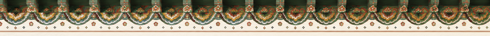

# 묵향(墨香) — 수묵화 인터랙티브 웹

> 한지 위에 먹이 번지는 물성을 WebGL2 유체 시뮬레이션으로 재현한 수묵화 튜토리얼 · 드로잉 웹앱

**Live**: https://muk-pi.vercel.app



## 소개

보이지 않는 붓이 한국 수묵화 10폭을 획 순서대로 그려내는 갤러리이자,
마우스(터치)로 직접 먹을 치며 발묵·갈필·파묵을 체험할 수 있는 연습장입니다.

프레임워크·빌드 도구 없이 **단일 `index.html`** 로 동작합니다.
유체 역학(Navier-Stokes), 한지 섬유 질감, 붓소리까지 모두 절차적으로 생성합니다.

## 주요 기능

### 수묵화 갤러리 (자동 회화)
- 하단 한자 메뉴에서 10폭 선택: 龍 虎 鶴 月 梅 竹 瀑 蓮 山 魚
- 획 순서·필압·속도가 계획된 경로를 따라 보이지 않는 붓이 실시간으로 그림
- 작품마다 한시(漢詩)가 진행률에 따라 세로쓰기로 출력
- 완성 후 10초 뒤 다음 폭으로 자동 순환

### 백지 연습장 (白)
- 메뉴 끝의 **白** — 자동 회화 없이 순수 한지 위에서 자유롭게 연습

### 직접 그리기
- **드래그**: 속도에 따라 발묵(느림·번짐) ↔ 갈필(빠름·비백) 연속 전환
- **길게 누르기**: 먹이 고이며 초묵(焦墨)으로 침잠
- **더블탭**: 파묵(破墨) — 맑은 물이 먹을 밀어내며 번짐
- **우하단 더블탭**: 낙관(落款) 압인
- **붓 모드**(우하단 붓 아이콘): 커서 이동만으로 그리기 + 붓 효과 선택(붓결/발묵/갈필/농묵/담묵)

### 붓 크기 — 小 / 中 / 大
- 우하단에서 선택. 클수록 먹 침착량과 번짐 반경이 함께 커짐

### 채묵(彩墨) 컬러 팔레트 — 9색
- 우측 팔레트: 묵 · 청 · 적 · 황 · 남 · 갈 · 홍 · 자 · 록
- **획마다 다른 색**으로 그릴 수 있으며, 색이 먹과 함께 번지고 흐르고 섞임
- 색상 전용 시뮬레이션 레이어(tint FBO)가 이류·확산·파묵·용해를 먹과 동기화

### 그 밖에
- 먹 농담 슬라이더, 한지색 6종(백지·미색지·다색지·회지·청지·도홍지)
- 붓이 종이를 스치는 소리(Web Audio 절차 합성) + 배경음악
- 전시 모드(UI 숨김), 완성작 PNG 저장·공유
- `?gallery=1` — 10폭 자동 완성 PNG 일괄 내보내기(포트폴리오 모드)

## 기술

| 영역 | 구현 |
|---|---|
| 유체 시뮬레이션 | WebGL2, semi-Lagrangian advection + Jacobi pressure solve |
| 먹 거동 | 젖은 먹만 흐르는 잉크 advection, 마른 먹은 종이에 고정 |
| 번짐 | 한지 섬유 방향장을 따르는 이방성 확산, 가장자리 침전(커피링) |
| 한지 | 절차적 섬유결·방향장·얼룩 텍스처 (noise/fbm) |
| 채묵 | amount-가중 RGB tint FBO — 획별 색이 물리 시뮬레이션을 그대로 따름 |
| 소리 | Web Audio 절차 합성 (에셋 없음) |

## 실행

정적 사이트라 서버 없이도 열리지만, 로컬 서버 권장:

```bash
python3 -m http.server 8000
# → http://localhost:8000
```

## 배포

Vercel 정적 배포:

```bash
vercel deploy --prod
```

---

**SOAVIZ AI STUDIO**
